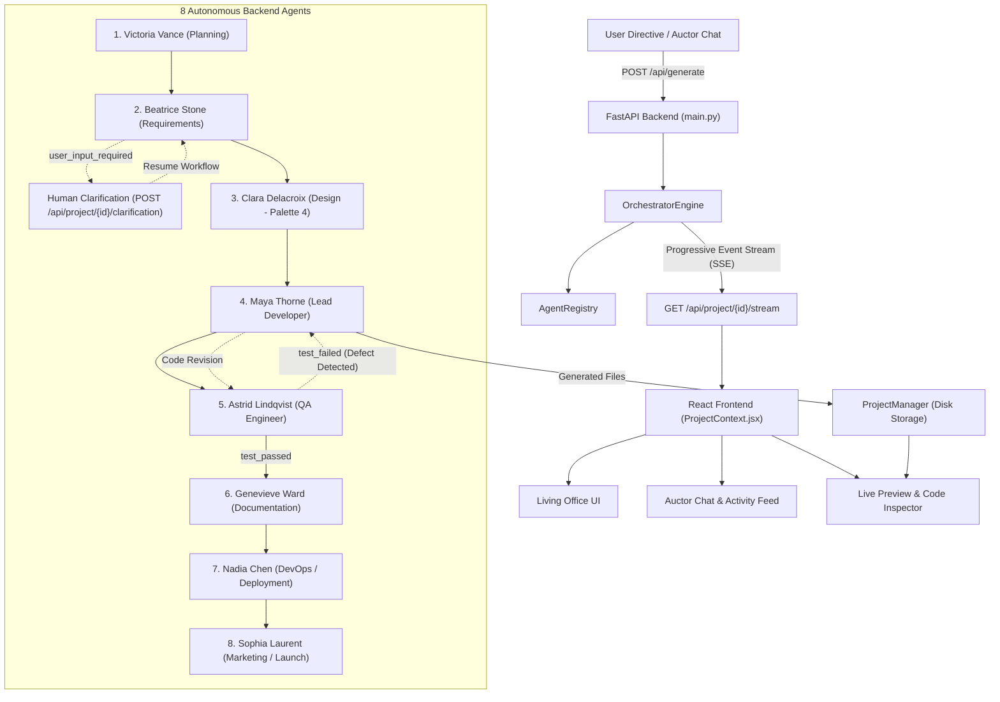

# Auctor Systems — Phase 3B Implementation & Verification Walkthrough

Phase 3B transforms Auctor Systems into an end-to-end, genuinely backend-integrated autonomous website generation platform. The system coordinates 8 specialized agents, a real-time event streaming pipeline, human-in-the-loop clarification, automated QA defect-revision loops, and continuous Live Preview updates with zero loss of Phase 3A aesthetics.

---

## 1. Architectural Overview

---

## 2. Core Components Implemented

### A. Backend Foundation & Agent Infrastructure
- **[`BaseAgent`](file:///c:/4th%20year%20project/backend/orchestrator/base_agent.py)**: Abstract base class enforcing the execution contract across all 8 agents. Standardizes typed event helpers (`emit_started`, `emit_thinking`, `emit_working`, `emit_message`, `emit_handoff`, `emit_completed`, `emit_error`).
- **[`ProjectContext`](file:///c:/4th%20year%20project/backend/orchestrator/context.py)**: Structured shared data model containing the user prompt, execution mode, architectural plan, requirements, clarification data, design system, generated files list, test results, and metadata.
- **[`WorkflowEvent`](file:///c:/4th%20year%20project/backend/orchestrator/events.py)**: Strongly typed event schema supporting `workflow_started`, `agent_started`, `agent_thinking`, `agent_working`, `agent_message`, `agent_handoff`, `agent_completed`, `agent_error`, `user_input_required`, `test_failed`, `test_passed`, `project_generated`, `workflow_completed`, and `heartbeat`. Supports standard `from`/`to` aliases.
- **[`AgentRegistry`](file:///c:/4th%20year%20project/backend/orchestrator/registry.py)**: Manages instances of the 8 agents in canonical pipeline order and injects the human-in-the-loop waiter callback.

### B. The Eight Backend Agents
1. **Victoria Vance** ([`victoria.py`](file:///c:/4th%20year%20project/backend/orchestrator/agents/victoria.py)): Analyzes directives, creates milestone schedules, and formulates the architectural blueprint.
2. **Beatrice Stone** ([`beatrice.py`](file:///c:/4th%20year%20project/backend/orchestrator/agents/beatrice.py)): Requirements Analyst driving the genuine human clarification flow with targeted questions and option pills.
3. **Clara Delacroix** ([`clara.py`](file:///c:/4th%20year%20project/backend/orchestrator/agents/clara.py)): Design Director synthesizing Palette 4 tokens (`#3A1028`, `#541B3B`, `#20243A`, `#B68A9A`, `#F5F4F5`, `#FFFFFF`, `#6B6C78`, `#29232B`, `#718276`, `#C79A4A`), typography scales, and responsive layout rules.
4. **Maya Thorne** ([`maya.py`](file:///c:/4th%20year%20project/backend/orchestrator/agents/maya.py)): Lead Developer generating production-grade semantic HTML5, CSS3, and ES6+ JavaScript. Handles code remediation passes during QA loops.
5. **Astrid Lindqvist** ([`astrid.py`](file:///c:/4th%20year%20project/backend/orchestrator/agents/astrid.py)): QA Engineer performing automated audits (DOCTYPE, Palette 4 tokens, event listeners, WCAG 2.1 AA accessibility). Triggers `test_failed` loopback to Maya on initial defect detection, then certifies code on the second pass (`test_passed`).
6. **Genevieve Ward** ([`genevieve.py`](file:///c:/4th%20year%20project/backend/orchestrator/agents/genevieve.py)): Documentation Lead producing `docs/README.md` and `docs/ARCHITECTURE.md`.
7. **Nadia Chen** ([`nadia.py`](file:///c:/4th%20year%20project/backend/orchestrator/agents/nadia.py)): DevOps Specialist generating production `deploy/vercel.json` edge routing and security headers.
8. **Sophia Laurent** ([`sophia.py`](file:///c:/4th%20year%20project/backend/orchestrator/agents/sophia.py)): Marketing Director creating `marketing/LAUNCH_COPY.md`, SEO meta tags, and social media copy.

### C. Orchestrator Engine & Event Streaming
- **[`OrchestratorEngine`](file:///c:/4th%20year%20project/backend/orchestrator/engine.py)**: Manages sequential execution, async task management, file disk persistence, and reconnect-safe event delivery with past event replay and 15s heartbeats.
- **Human-in-the-Loop Clarification**: Emits `user_input_required`, pauses via `asyncio.Future`, and resumes when the client hits `POST /api/project/{project_id}/clarification` or `/input`.
- **QA Loopback**: Detects `context.qa_needs_revision`, loops index back to Maya (index 3), allows Maya to refactor, and re-executes Astrid's audit suite.

### D. Resilient LLM Abstraction
- **[`LLMService`](file:///c:/4th%20year%20project/backend/services/llm_service.py)**: Interfaces with Google Gemini using `google-genai` when `GEMINI_API_KEY` is configured. If credentials are unset or the service is offline, gracefully degrades to deterministic, persona-rich generation tailored to the user prompt.

### E. Frontend Integration
- **[`ProjectContext.jsx`](file:///c:/4th%20year%20project/frontend/src/context/ProjectContext.jsx)**: Connects React to `/api/generate` and `/api/project/{id}/stream`. Routes backend events to `orchestratorState`, `agentStatuses`, `activityLog`, `eventLogs`, and `codeCache`. Supports answering clarification questions directly via `api.submitClarification()`.
- **[`SSEStreamListener`](file:///c:/4th%20year%20project/frontend/src/api/sse.js)**: Subscribes to custom EventSource event names, parsing typed events without connection loss.

---

## 3. End-to-End Verification Results

### Automated Test Suites
1. **Existing Test Suite (`test_phase1.py`)**:
   - **Result**: 15 passed, 0 failed out of 15 tests.
   - Verified backward compatibility with all Phase 1 routes, file parsers, and zip exports.
2. **Phase 3B Dedicated Test Suite (`test_phase3b.py`)**:
   - **Result**: 100% PASS.
   - Verified `OrchestratorEngine`, Beatrice clarification pause, user input resumption, Astrid defect detection (`test_failed`), Maya code revision, Astrid certification (`test_passed`), disk persistence of 7 files, and SSE streaming.
3. **Frontend Production Build (`npm run build`)**:
   - **Result**: Built cleanly with zero errors in 377ms.

### Browser End-to-End Flow
A full browser session was executed and recorded:
- **Recording File**: [phase3b_e2e_flow.webp](file:///C:/Users/Sravya/.gemini/antigravity-ide/brain/0f274e03-e973-449c-81f1-997f61bfc590/phase3b_e2e_flow_1790014468170.webp)

#### Visual Evidence from E2E Flow:

1. **Beatrice Stone Human Clarification Prompt**:
   Beatrice pauses the pipeline and asks the user to select an architectural direction in Auctor Chat:
   

2. **Completed Generation & Live Preview**:
   The 8 agents complete their tasks, Astrid certifies the QA pass, and Live Preview renders the generated website:
   

3. **Source Code Inspector**:
   Displaying all 7 generated files (`src/index.html`, `src/style.css`, `src/script.js`, `docs/README.md`, `docs/ARCHITECTURE.md`, `deploy/vercel.json`, `marketing/LAUNCH_COPY.md`):
   

4. **Expanded Live Preview Modal**:
   Full-screen modal rendering the interactive website with working tabs and dialogs:
   

---

## 4. Summary of Verification Checkpoints Satisfied

- [x] Auctor Chat & Orchestrator UI preserved with Palette 4 tokens.
- [x] Living Office animated state transitions reflect real backend agents.
- [x] 8 backend agents (Victoria, Beatrice, Clara, Maya, Astrid, Genevieve, Nadia, Sophia) implemented.
- [x] Genuine backend-driven human clarification flow (Beatrice pauses $\to$ `user_input_required` $\to$ Auctor Chat answer $\to$ `POST /api/project/{id}/clarification` $\to$ backend resumes).
- [x] Astrid ↔ Maya QA revision loop (`test_failed` on defect $\to$ Maya refactor $\to$ `test_passed`).
- [x] Real generated files feed Live Preview, Code Inspector, and Expanded Preview.
- [x] Graceful local fallback ensures the application runs even without `GEMINI_API_KEY`.
- [x] All automated and manual responsiveness tests passed across Desktop, Tablet, and Mobile viewports.
